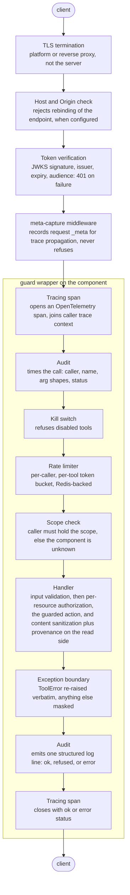
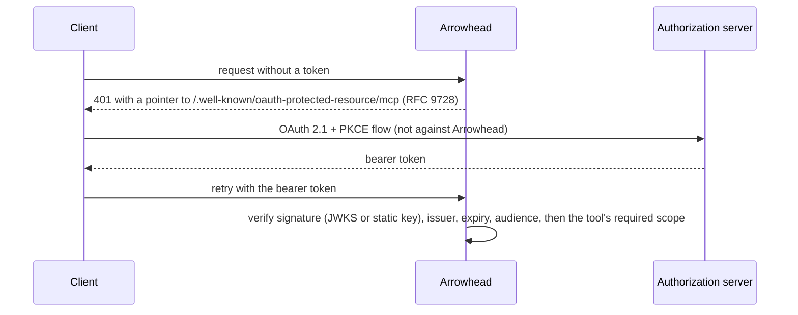
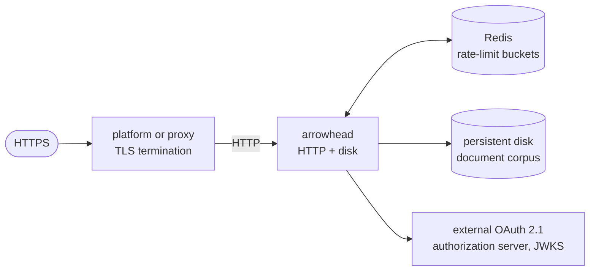

# Architecture

Arrowhead is an application on the official MCP Python SDK (the `mcp` package,
version 2), served over streamable HTTP in stateless mode (stdio for local
development). Stateless means the server keeps no per-session state, so any
replica can serve any request and horizontal scaling needs no sticky sessions.
Shared state that must survive across replicas — the rate-limit buckets — lives
in Redis, keyed explicitly rather than by transport session.

One endpoint serves both protocol eras. A request carrying the reserved `_meta`
envelope takes the sessionless 2026-07-28 leg; a request that sends the
`initialize` lifecycle takes the handshake-era leg, negotiated down to the
latest handshake version. The SDK routes between them; the application
configures nothing.

## Request flow

The guards do not live in message middleware. Each tool, resource, and prompt is
registered wrapped in a guard chain (`arrowhead.runtime.guards`) that reproduces
the prior middleware order on the component itself, so an import-and-call
invocation (`Arrowhead.call`) runs the identical path as an HTTP request with no
duplicated logic. Two thin SDK middlewares remain, and neither refuses: one
records the request `_meta` for trace-context propagation, the other filters
list results by the kill switch and scope. Every refusal lives in the wrapper.



The scope check is a capability gate (may this caller use this tool at all).
The per-resource authorization inside the document tools is a separate, finer
gate (may this caller act on this specific document): identity comes from the
validated token, the default policy is deny, and a denial is audited as an
`AuthorizationError` refusal without echoing the resource.

A refusal at any stage (401, kill switch, rate limit, scope, per-resource
authorization, or a validation failure inside the tool) still produces an audit
line and a closed span, so nothing is invisible to operators.

## Authentication flow



Arrowhead issues no tokens and stores no client secrets. It is purely a
resource server.

## Module layout

```
src/arrowhead/
  server.py              builds the MCPServer: verifier + cache hints + components
  app.py                 importable facade: call, read_resource, get_prompt
  cli.py                 the arrowhead console script: serve, list-tools
  config.py              all settings, ARROWHEAD_-prefixed environment vars
  errors.py              the project ToolError every guard and tool raises
  health.py              unauthenticated /health and /ready probe routes
  runtime/
    guards.py            per-component guard wrappers + listing filter
  auth/
    oauth.py             resource server wiring + mandatory audience validation
    verifier.py          in-house JWKS bearer verifier (pyjwt)
    scopes.py            component -> required scope, split by verb
    identity.py          caller identity from the validated token only
    principal.py         in-process principal for the import path
  authz/
    policy.py            default-deny per-resource ABAC + Authorizer seam
    enforce.py           enforcement point every component calls
    confirmation.py      Resolve-based confirmation for destructive actions
  store/
    document_store.py    jailed corpus: read, list, stat, atomic write
  repo/
    store.py             jailed, read-only source tree
    symbols.py           symbol extraction (ast / tree-sitter / heuristic)
    ts_symbols.py        the optional tree-sitter backend (treesitter extra)
    dependencies.py      bounded Python import graph
  content/
    provenance.py        untrusted-data wrapping with randomized delimiters
    render.py            shared format-aware document renderer
    chunking.py          bounded character windows
    code_chunking.py     structure-aware chunking for source files
    json_safe.py, markdown_safe.py, text_safe.py   format sanitizers
  tools/
    catalog.py           the component contract: specs, families, profiles
    registry.py          registers in-profile components behind the guards
    integrity.py         the pinned tool-surface digest
    search_core.py       the shared search runner behind doc_search/code_search
    <tool>.py            one module per tool
  connectors/
    sql.py               vetted read-only SQL over a pooled async engine
    pgvector.py          pgvector search with server-side tenant isolation
    hybrid.py            vector + full-text fusion retrieval
    pgvector_index.py    diff-aware chunk-and-embed ingestion
    tasks.py             handle-based async tasks and timers, owner-scoped
  memory/
    base.py              the memory backend seam: memories + kv scratchpad
    factory.py           file backend by default, Postgres when memory_dsn set
    file_backend.py      jailed JSON records, hashed-owner paths, keyword recall
    postgres_backend.py  fixed-table SQL, optional pgvector semantic recall
  embeddings/
    base.py, factory.py  the embedding provider seam
    deterministic.py     offline stdlib embedder for tests and demos
    http.py              SSRF-guarded OpenAI-compatible embedding client
  llm/
    base.py, transport.py, anthropic_http.py, openai_http.py, factory.py
                         the completion provider seam, one hardened HTTP path
  exec/
    base.py              the runner seam: request and outcome
    factory.py           picks the configured runner
    subprocess_runner.py rlimit-bounded, env-scrubbed subprocess
    container_runner.py  network-none, read-only container runner
  workingsets.py         owner-scoped working set registry
  resources/, prompts/, completions/                the non-tool primitives
  security/
    ssrf_guard.py        resolve, block private ranges, pin; trusted-internal gate
    input_validation.py  shared allowlist validators
    sandbox.py           AST arithmetic interpreter (no eval)
    search_match.py      ReDoS-safe literal / timed-regex matcher
    secret_scan.py       fixed-pattern secret/PII detection and redaction
    rate_limit.py        token-bucket limiter, memory or Redis store
    kill_switch.py       per-component disable
  observability/
    audit_log.py         structured, source-redacted audit line
    tracing.py           OpenTelemetry span + W3C trace context
    telemetry.py         OTLP exporter wiring, no-op until configured
    metrics.py           tool-call count and duration instruments
```

## Deployment shape



The request path itself is stateless — any instance can serve any request,
and the rate-limit buckets live in shared Redis. The durable local state is
the write-capable document corpus and, in the default file-backed
configuration, the agent memory root, both on a persistent disk. Because a
disk attaches to a single instance, the reference deployment runs **one**
instance so the corpus stays consistent; scaling the write tier horizontally
means moving the corpus behind object storage (a roadmap item) and pointing
memory at Postgres (`ARROWHEAD_MEMORY_DSN`, supported today) so the request
tier can again run many replicas. See `deploy/` for the container image and
the Render and Fly.io blueprints.

Three families carry their own architectural gates. Memory sits behind a
backend seam like the embedding and completion providers: the jailed file
backend needs no configuration and reports keyword recall, the Postgres
backend takes over when `ARROWHEAD_MEMORY_DSN` is set, and semantic recall
only engages when the real embedding provider is configured, so a search
result's `recall` label always tells the truth. Timer tasks share the
in-process task registry and its documented single-instance limitation: a
pending timer does not survive a restart. The notify family is registered
only when `ARROWHEAD_NOTIFY_ALLOWLIST` is non-empty (the exec_enabled
pattern) so the default catalog never lists a tool that cannot succeed.
